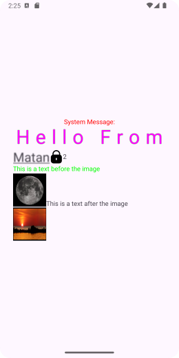

# Easy Spannable

SpanableStringLib is an Android library designed to simplify the usage of 'SpannableString'.   
It provides an easy-to-use API for applying various spans to text, making it more convenient to   
style strings without dealing with the complexities of 'SpannableString; directly.   

## Features
- Apply different spans (e.g., Bold, Underline, Color).  
- Chain multiple spans for complex text styling.  
- Support custome spans.  

## Usage

### Basic Usage

```java
SpanText.SpanString spanString = new SpanText.SpanString();
spanString.addNewLine("Hello From Cohen");
SpanText spanText = new SpanText();
spanText.add(spanString);
```

### Applying Color, Size, Shadow

```java
SpanText.SpanString spanString = new SpanText.SpanString();
spanString.addNewLine("Hello From")
        .add(new SpanText.Size(10))
        .add(new SpanText.Color(Color.YELLOW))
        .add(new SpanText.Shadow(2.5F, 0.2F, 0.4F, Color.GREEN));
SpanText spanText = new SpanText();
spanText.add(spanString);
```

### Applying two Strings With different spans

```java
        SpanText.SpanString spanString0 = new SpanText.SpanString();
        spanString0.addNewLine("System Message:")
        .add(new SpanText.AlignCenter())
        .add(new SpanText.Color(Color.RED));

SpanText.SpanString spanString = new SpanText.SpanString();
spanString.addNewLine("Hello From")
        .add(new SpanText.Size(3))
        .add(new SpanText.LetterSpacing(0.3F))
        .add(new SpanText.Color(Color.MAGENTA))
        .add(new SpanText.Shadow(2.5F, 0.2F, 0.4F, Color.GREEN));

SpanText.SpanString spanString2 = new SpanText.SpanString();
spanString2.add("Matan")
        .add(new SpanText.Size(2))
        .add(new SpanText.Underline())
        .add(new SpanText.Blur(3.5F));

SpanText.SpanString spanString3 = new SpanText.SpanString();
spanString3.addImage(getResources(), R.drawable.ic_safe, 80);

SpanText.SpanString spanString4 = new SpanText.SpanString();
spanString4.add("2")
        .add(new SpanText.Superscript(Spannable.SPAN_EXCLUSIVE_EXCLUSIVE));


SpanText spanText = new SpanText();
spanText.add(spanString0).add(spanString).add(spanString2).add(spanString3).add(spanString4);

id_main_txt.setText(spanText.makeSpannableString());
```

### Applying images with URL

```java
SpanText.SpanString spanString0 = new SpanText.SpanString();
        spanString0.addNewLine("System Message:")
                .add(new SpanText.AlignCenter())
                .add(new SpanText.Color(Color.RED));

        SpanText.SpanString spanString = new SpanText.SpanString();
        spanString.addNewLine("Hello From")
                .add(new SpanText.Size(3))
                .add(new SpanText.LetterSpacing(0.3F))
                .add(new SpanText.Color(Color.MAGENTA))
                .add(new SpanText.Shadow(2.5F, 0.2F, 0.4F, Color.GREEN));

        SpanText.SpanString spanString2 = new SpanText.SpanString();
        spanString2.add("Matan")
                .add(new SpanText.Size(2))
                .add(new SpanText.Underline())
                .add(new SpanText.Blur(3.5F));

        SpanText.SpanString spanString3 = new SpanText.SpanString();
        spanString3.addImage(getResources(), R.drawable.ic_safe, 80);

        SpanText.SpanString spanString4 = new SpanText.SpanString();
        spanString4.add("2\n")
                .add(new SpanText.Superscript(Spannable.SPAN_EXCLUSIVE_EXCLUSIVE));


        // Initialize SpanText and SpanString globally
        SpanText spanText = new SpanText();
        SpanText.SpanString spanStringI2 = new SpanText.SpanString();
        SpanText.SpanString spanStringI1 = new SpanText.SpanString();

        // Add other spans or text to spanString if needed
        spanStringI2.addNewLine("This is a text after the image");

        // Load the image asynchronously
        spanStringI1.addImage("https://upload.wikimedia.org/wikipedia/commons/thumb/e/e1/FullMoon2010.jpg/1024px-FullMoon2010.jpg", new ImageLoadCallback() {
            @Override
            public void onImageLoaded() {

                // The image has been loaded, now update spanText
                spanText.add(spanStringI1);
                spanText.add(spanStringI2);
                // Update the TextView with the SpannableString
                id_main_txt.setText(spanText.makeSpannableString());
            }
        });

        // You can continue to use spanText and spanString elsewhere in your code
        SpanText.SpanString spanStringI = new SpanText.SpanString();
        spanStringI.addNewLine("This is a text before the image");
        spanStringI.add(new SpanText.Color(Color.GREEN));


        SpanText.SpanString spanStringIM1 = new SpanText.SpanString();

        // Load the image asynchronously
        spanStringIM1.addImage("https://upload.wikimedia.org/wikipedia/commons/1/14/Panorama_Sunset_In_Bat_Yam.jpg", new ImageLoadCallback() {
            @Override
            public void onImageLoaded() {

                // The image has been loaded, now update spanText
                spanText.add(spanStringIM1);
                // Update the TextView with the SpannableString
                id_main_txt.setText(spanText.makeSpannableString());
            }
        });

        spanText.add(spanString0).add(spanString).add(spanString2).add(spanString3).add(spanString4).add(spanStringI);
        id_main_txt.setText(spanText.makeSpannableString());
```


## What's new
# 1.00.01:

SpannableString Flag option to the SpantType Creation

# 1.00.02:

Image icon can be added to SpannableString

# 1.00.03:

Image can be added with URL's from web

## License
        
```
Copyright (c) 2015-2024 Matan Ovadya Cohen Tsedek

Licensed under the Apache License, Version 2.0 (the "License");  
you may not use this file except in compliance with the License.  
You may obtain a copy of the License at  

   http://www.apache.org/licenses/LICENSE-2.0  

Unless required by applicable law or agreed to in writing, software  
distributed under the License is distributed on an "AS IS" BASIS,  
WITHOUT WARRANTIES OR CONDITIONS OF ANY KIND, either express or implied.  
See the License for the specific language governing permissions and  
limitations under the License.

This project uses the Glide library, which is licensed under the Apache License,
Version 2.0. You may obtain a copy of the License at http://www.apache.org/licenses/LICENSE-2.0

This project includes images from Wikipedia, which are licensed under the
Creative Commons Attribution-ShareAlike 4.0 International (CC BY-SA 4.0) license.
Each image's source and license information can be found in the `README.md` file.
  
```

## Credits

safe icon: Icon made by Flat Icons (www.flat-icons.com) from www.flaticon.com 

### Libraries Used
- [Glide](https://github.com/bumptech/glide) - An image loading and caching library for Android

## Images Used
This project uses images from Wikipedia:
- Image of [Panorama_Sunset_In_Bat_Yam](https://upload.wikimedia.org/wikipedia/commons/1/14/Panorama_Sunset_In_Bat_Yam.jpg) - Licensed under [CC BY-SA 4.0](https://creativecommons.org/licenses/by-sa/4.0/)
- Image of [FullMoon2010](https://upload.wikimedia.org/wikipedia/commons/thumb/e/e1/FullMoon2010.jpg/1024px-FullMoon2010.jpg) - Licensed under [CC BY-SA 4.0](https://creativecommons.org/licenses/by-sa/4.0/)


